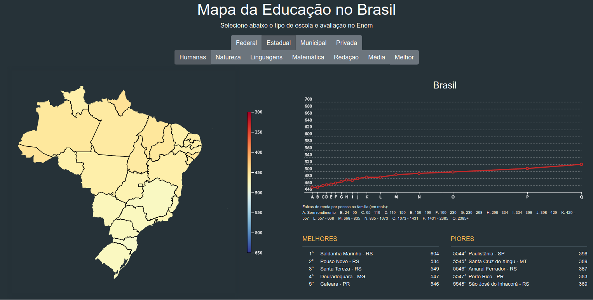
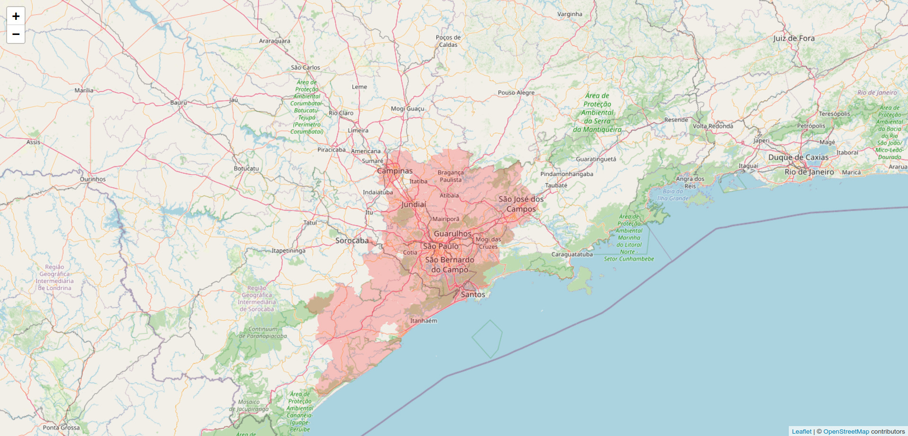

# About me

**Hi there 👋 My name is Vinicius Carmo!**

I am a MSc student at the University of São Paulo, Brazil, under the computer engineering department. My topic of research is Question Answering Systems, and it involves a lot of Natural Language Processing and Machine Learning, specially Deep Leaning. 

I try to always write in English, but some content are targeted to Brazilian audience, so they will be in Portuguese. 

Check also my notebooks on [kaggle](https://www.kaggle.com/viniciuscleves).

## My toy projects

### Mapa da Educação no Brasil (Brazilian Education Map) 
[ [repository](https://github.com/vinicius-cleves/enem) | [website](https://vinicius-cleves.github.io/enem/visualization/) ]

Visualization is a powerful tool to explore large amounts of data. This project created a visualization that allows you to interact with statistics about the quality of the education in brazil obtained from the ENEM 2018 data. 

ENEM is a test almost every Brazilian student takes after high school to enter the university. It is like the SAT exam on the United States. They release microdata with grades and social-economic information about all students that sign up for the exam. 

You can check the visualization created on [GitHub Pages](https://vinicius-cleves.github.io/enem/visualization/). There you can interact with the map and observe the distribution of student performance by subject, type of school, region and income.

### Brasil em Chamas (Brazil on Fire)
[ [repository](https://github.com/vinicius-cleves/brasil-em-chamas) | [website](https://vinicius-cleves.github.io/brasil-em-chamas/) ]

Brazil is facing a growing number of devastation by wildfires. By the time of writing, only in Pantanal (Brazilian wetlands), more than 23,000 km2 were burned just on 2020. This number doesn't provide a clear picture of how much it represents, though, especially for people that are not a number person. 

In order to offer people a clear dimension of the ongoing tragedy this devastation represents, I built a [website](https://vinicius-cleves.github.io/brasil-em-chamas/) where users can select a point on Brazil's map and it will mark a region around that point with area equivalent to the one destroyed on Pantanal.

I plan to include more options on this website soon, like the area devastated on other ecosystems. 

### Portugal em Chamas (Portugal on Fire)
[ [repository](https://github.com/vinicius-cleves/portugal-em-chamas) | [website](https://vinicius-cleves.github.io/portugal-em-chamas/) ]

This is a spin-off from [Brazil em Chamas](#brasil-em-chamas). It is a joint effort with the collaborators from [JEST](http://www.jest.pt/), a Junior Enterprise from the University of Coimbra. 

## My Blog posts

1. [App Scraping](https://medium.com/turing-talks/app-scraping-628e7fc514a0): a step-by-step guide on how to do scraping on smartphone apps.
<!--
**vinicius-cleves/vinicius-cleves** is a ✨ _special_ ✨ repository because its `README.md` (this file) appears on your GitHub profile.

Here are some ideas to get you started:

- 🔭 I’m currently working on ...
- 🌱 I’m currently learning ...
- 👯 I’m looking to collaborate on ...
- 🤔 I’m looking for help with ...
- 💬 Ask me about ...
- 📫 How to reach me: ...
- 😄 Pronouns: ...
- ⚡ Fun fact: ...
-->
